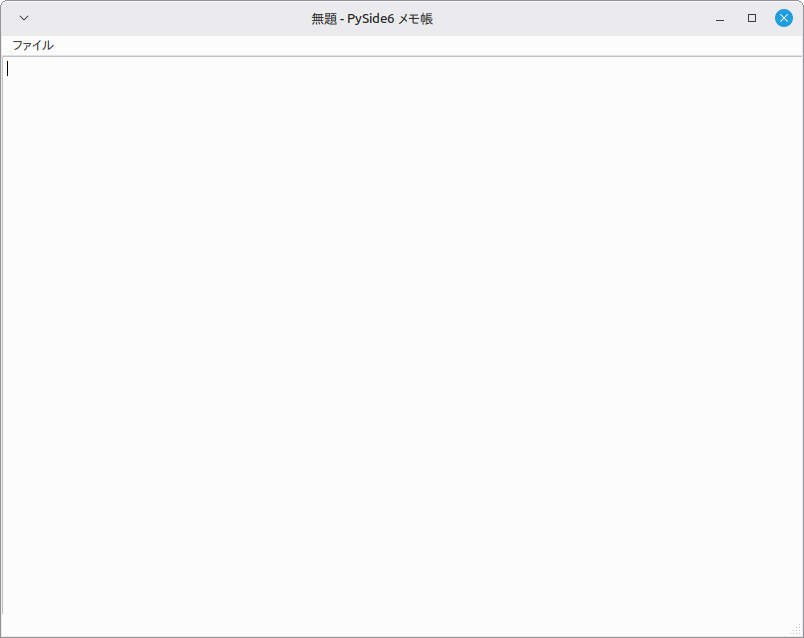

# PySide6 Notepad (Version 1.0)

PySide6とQt Designerを使用して作成した、シンプルなテキストエディタです。

PythonによるGUIアプリケーション開発と、QtのSignal／Slotの仕組みを学習することを目的として作成しています。

## 概要

Qt Designerで画面を作成し、Python側でファイル操作やメニュー処理を実装しています。

第1版では、メモ帳として必要な基本的なファイル操作を実装しています。

## 実装機能

### Version 1.0 の実装機能
* 新規作成
* テキストファイルを開く
* 上書き保存
* 名前を付けて保存
* アプリケーションの終了
* 開いているファイル名のタイトルバー表示
* ファイル読み込み時のエラーダイアログ
* ファイル保存時のエラーダイアログ

## 開発環境

* Python 3
* PySide6
* Qt Designer
* Visual Studio Code
* Linux Mint

## ファイル構成

```text
PySide6-Notepad/
├── main.py
├── mainWindow.ui
├── requirements.txt
├── README.md
└── .gitignore
```

### main.py

アプリケーションの起動、UIファイルの読み込み、メニュー操作、ファイルの読み書きを実装しています。

### mainWindow.ui

Qt Designerで作成した画面定義ファイルです。

### requirements.txt

アプリケーションの実行に必要なPythonライブラリを記載しています。

## セットアップ

### 1. リポジトリを取得

```bash
git clone https://github.com/kazu025/PySide6-Notepad.git
cd PySide6-Notepad
```

### 2. 仮想環境を作成

```bash
python3 -m venv .venv
```

### 3. 仮想環境を有効化

Linuxの場合：

```bash
source .venv/bin/activate
```

Windows PowerShellの場合：

```powershell
.venv\Scripts\Activate.ps1
```

### 4. 必要なライブラリをインストール

```bash
pip install -r requirements.txt
```

## 実行方法

```bash
python main.py
```

`main.py`と`mainWindow.ui`は、同じディレクトリに配置してください。

## 使用ライブラリ

主に次のPySide6モジュールを使用しています。

```python
from PySide6.QtCore import QFile
from PySide6.QtUiTools import QUiLoader
from PySide6.QtWidgets import (
    QApplication,
    QFileDialog,
    QMainWindow,
    QMessageBox,
)
```

Python標準ライブラリとして、次を使用しています。

```python
import sys
from pathlib import Path
```

## 実装のポイント

### Qt Designerで作成したUIの読み込み

`QUiLoader`を使用して、`mainWindow.ui`を実行時に読み込んでいます。

```python
loader = QUiLoader()
ui_file = QFile("mainWindow.ui")
self.window = loader.load(ui_file)
```

### SignalとSlotの接続

メニューの操作とPython側の処理を、`connect()`で接続しています。

```python
self.window.actionNew.triggered.connect(self.new_file)
self.window.actionOpen.triggered.connect(self.open_file)
self.window.actionSave.triggered.connect(self.save_file)
self.window.actionSaveAs.triggered.connect(self.save_file_as)
self.window.actionExit.triggered.connect(self.window.close)
```

### 現在のファイルを管理

現在開いているファイルのパスは、`current_file`で管理しています。

```python
self.current_file: Path | None = None
```

まだ保存していない文書の場合は`None`、ファイルを開いた後や保存した後は`Path`オブジェクトが格納されます。

### UTF-8でのファイル読み書き

テキストファイルはUTF-8で読み書きしています。

```python
text = Path(file_path).read_text(encoding="utf-8")
```

```python
file_path.write_text(text, encoding="utf-8")
```

## スクリーンショット
Version 1.0 の実行画面です


## 今後の予定

### Version 2.0

* 未保存の変更がある場合、タイトルに`*`を表示
* 終了時に保存確認ダイアログを表示
* 新規作成時に保存確認ダイアログを表示

### Version 3.0

* Undo
* Redo
* Cut
* Copy
* Paste

### 将来追加したい機能

* 文字列検索
* 文字列置換
* フォント変更
* ステータスバー
* 最近使用したファイル
* 文字コードの選択

## 学習内容

このアプリケーションの作成を通して、次の内容を学習します。

* PySide6によるGUIアプリケーション開発
* Qt Designerの使用方法
* WidgetとActionの`objectName`
* Signal／Slot
* ファイルダイアログ
* メッセージボックス
* Pythonの例外処理
* `pathlib.Path`を使用したファイル操作
* 仮想環境
* Git／GitHubによるバージョン管理

## 更新履歴

### Version 1.0
- 新規作成
- ファイルを開く
- 上書き保存
- 名前を付けて保存
- タイトルバーにファイル名を表示
- エラーダイアログ表示

