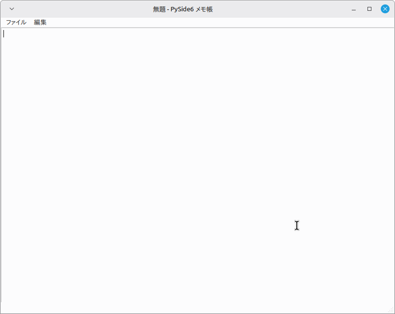

# PySide6 Notepad

PySide6 と Qt Designer を使用して作成した、学習用のシンプルなメモ帳アプリケーションです。

PythonによるGUIアプリケーション開発を学ぶことを目的として、機能を段階的に追加しながら開発しています。

---

## Version 4.0

検索機能を追加しました。

- 検索（Ctrl+F）
- 次を検索（F3）
- ラップアラウンド検索
  （文書の最後まで検索すると、自動的に先頭へ戻って検索を続けます。）

---

## 現在の機能

- ✅ ファイルの新規作成
- ✅ 開く
- ✅ 保存
- ✅ 名前を付けて保存
- ✅ 未保存変更の管理
- ✅ Undo / Redo
- ✅ Cut / Copy / Paste
- ✅ Select All
- ✅ 検索（Ctrl+F）
- ✅ 次を検索（F3）
- ✅ ラップアラウンド検索

---

## スクリーンショット

現在の実行画面です。

※ Version 4.0では検索機能（Ctrl+F、F3、ラップアラウンド検索）を追加しましたが、
メイン画面の構成はVersion 3.0から変更ありません。



---

## 開発環境

* Python 3.x
* PySide6 6.11.1
* Qt Designer
* Linux Mint
* Visual Studio Code

---

## 使用ライブラリ

```bash
pip install PySide6
```

---

## 実行方法

```bash
python3 main.py
```

---

## プロジェクト構成

```text
PySide6-Notepad/
├── main.py
├── mainWindow.ui
├── README.md
└── images/
```

---

## 学んだこと

### Version 4.0

- QTextEdit.find()
- QInputDialog
- 検索機能の実装
- ラップアラウンド検索
- QTextCursor

### Version 3.0
- QAction
- triggeredシグナル
- QTextEdit標準編集機能
- ショートカットキーの設定
- Qt Designerとの連携

### Version 2.0

* Qt Designerで作成したUIの読み込み
* QUiLoaderの利用
* QFileDialogによるファイル操作
* pathlibによるファイル入出力
* QMessageBoxによるダイアログ表示
* QTextDocumentによる変更状態の管理
* modificationChangedシグナル
* eventFilter()による終了イベントの処理
* Pythonの型ヒント（Type Hint）

---

## Version 5.0 (予定)

- ステータスバー

---

## バージョン履歴

### Version 1.0
- 新規作成
- 開く
- 保存
- 名前を付けて保存

### Version 2.0
- 未保存変更の管理
- タイトルバーに変更マーク（*）
- 終了時・新規作成時・ファイルを開く前の保存確認

### Version 3.0
- Undo / Redo
- Cut / Copy / Paste
- Select All
- ショートカットキー対応

### Version 4.0
- 検索（Ctrl+F）
- 次を検索（F3）
- ラップアラウンド検索

---
## ライセンス

MIT License
