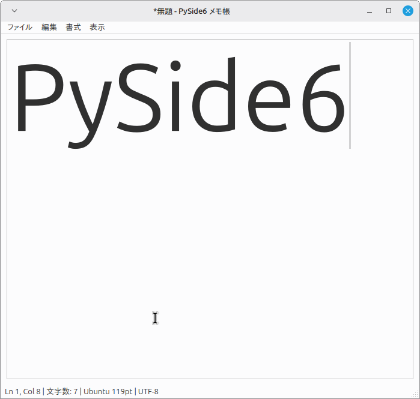

# PySide6 Notepad

PySide6 と Qt Designer を使用して作成した、学習用のシンプルなメモ帳アプリケーションです。

PythonによるGUIアプリケーション開発を学ぶことを目的として、機能を段階的に追加しながら開発しています。

---

## Version 11.0

テキスト表示のズーム機能を追加しました。

表示メニューまたはショートカットキーから、
テキストを拡大・縮小したり、初期サイズへ戻したりできます。

また、現在のズーム段階をQSettingsに保存し、
アプリを再起動しても前回の表示サイズを復元します。

### 追加した機能

* テキスト表示の拡大
* テキスト表示の縮小
* 初期表示サイズへのリセット
* ズーム操作のショートカットキー
* QTextEdit.zoomIn()
* QTextEdit.zoomOut()
* QSettingsによるズーム段階の保存
* アプリ再起動時のズーム状態復元

---

## 現在の機能

* ✅ ファイルの新規作成
* ✅ 開く
* ✅ 保存
* ✅ 名前を付けて保存
* ✅ 未保存変更の管理
* ✅ Undo / Redo
* ✅ Cut / Copy / Paste
* ✅ Select All
* ✅ 検索（Ctrl+F）
* ✅ 次を検索（F3）
* ✅ ラップアラウンド検索
* ✅ 行番号表示
* ✅ 列番号表示
* ✅ 文字数表示
* ✅ フォント変更
* ✅ フォントサイズ変更
* ✅ 最近使ったファイル（MRU）
* ✅ 履歴の保存
* ✅ 履歴からファイルを開く
* ✅ 履歴をクリア
* ✅ UTF-8 / Shift_JIS の文字コード選択
* ✅ 文字コード指定による読み込み・保存
* ✅ ウィンドウサイズ変更
* ✅ テキスト編集領域の自動リサイズ
* ✅ ウィンドウ位置・サイズの保存と復元
* ✅ 折り返し表示のON / OFF
* ✅ 折り返し表示設定の保存と復元
* ✅ テキスト表示の拡大・縮小
* ✅ ズーム状態の保存と復元
* ✅ 初期表示サイズへのリセット

---

## スクリーンショット

現在の実行画面です。



---

## 開発環境

* Python 3.x
* PySide6 6.11.1
* Qt Designer
* Linux Mint
* Visual Studio Code

---

## 使用ライブラリ

```bash
pip install PySide6
```

---

## 実行方法

```bash
python3 main.py
```

---

## プロジェクト構成

```text
PySide6-Notepad/
├── main.py
├── mainWindow.ui
├── README.md
└── images/
```

---

## 学んだこと

### Version 11.0

* QTextEdit.zoomIn()
* QTextEdit.zoomOut()
* ズーム段階の管理
* QSettingsによる数値設定の保存
* アプリ起動時のズーム状態復元
* QActionのショートカット設定

### Version 10.0

* QTextEditの折り返し表示
* `QTextEdit.setLineWrapMode()`
* `QTextEdit.LineWrapMode.WidgetWidth`
* `QTextEdit.LineWrapMode.NoWrap`
* checkableなQAction
* QActionのchecked状態
* シグナルからbool値を受け取る方法
* 表示設定と処理の分離
* QSettingsによる表示設定の永続化
* アプリ起動時の設定復元

### Version 9.0

* Qt DesignerのLayout
* QVBoxLayout
* QWidget.saveGeometry()
* QWidget.restoreGeometry()
* QSettingsによるウィンドウ状態の保存
* eventFilter()での終了イベント処理
* GUI部品の自動リサイズ

### Version 8.0

* Pythonの文字コード（encoding）
* UTF-8 / Shift_JIS
* QActionGroup
* QActionのcheckable
* 排他的なAction選択
* UnicodeEncodeError
* UnicodeDecodeError
* Pythonのstrとファイルエンコーディングの関係

### Version 7.0

* QSettings
* QMenu
* QAction（動的生成）
* addMenu()
* addSeparator()
* lambda式によるシグナル接続
* 設定情報の永続化

### Version 6.0

* QFontDialog
* QFontDialog.getFont()
* QFont
* QWidget.setFont()
* 現在のフォント取得
* ダイアログのOK／キャンセル判定

### Version 5.0

* QStatusBar
* QStatusBar.showMessage()
* cursorPositionChangedシグナル
* textChangedシグナル
* QTextCursor
* blockNumber()
* positionInBlock()
* ステータスバーの更新

### Version 4.0

* QTextEdit.find()
* QInputDialog
* 検索機能の実装
* ラップアラウンド検索
* QTextCursor

### Version 3.0

* QAction
* triggeredシグナル
* QTextEdit標準編集機能
* ショートカットキーの設定
* Qt Designerとの連携

### Version 2.0

* Qt Designerで作成したUIの読み込み
* QUiLoaderの利用
* QFileDialogによるファイル操作
* pathlibによるファイル入出力
* QMessageBoxによるダイアログ表示
* QTextDocumentによる変更状態の管理
* modificationChangedシグナル
* eventFilter()による終了イベントの処理
* Pythonの型ヒント（Type Hint）

---

## バージョン履歴

### Version 1.0

* 新規作成
* 開く
* 保存
* 名前を付けて保存

### Version 2.0

* 未保存変更の管理
* タイトルバーに変更マーク（*）
* 終了時・新規作成時・ファイルを開く前の保存確認

### Version 3.0

* Undo / Redo
* Cut / Copy / Paste
* Select All
* ショートカットキー対応

### Version 4.0

* 検索（Ctrl+F）
* 次を検索（F3）
* ラップアラウンド検索

### Version 5.0

* ステータスバー
* 行番号表示（Line）
* 列番号表示（Column）
* 文字数表示

### Version 6.0

* フォント選択ダイアログ
* フォントファミリ変更
* フォントサイズ変更

### Version 7.0

* 最近使ったファイル（MRU）
* 履歴の保存
* 履歴からファイルを開く
* 履歴をクリア
* 存在しないファイルの自動削除

### Version 8.0

* UTF-8 / Shift_JIS の文字コード選択
* QActionGroupによる排他的選択
* 選択した文字コードで読み込み・保存
* ステータスバーに文字コードを表示
* UnicodeDecodeError / UnicodeEncodeError のエラー処理

### Version 9.0

* ウィンドウサイズ変更
* QTextEditの自動リサイズ
* ウィンドウ位置・サイズの保存
* アプリ起動時のウィンドウ状態復元

### Version 10.0

* 折り返し表示のON / OFF
* WidgetWidth / NoWrapの切り替え
* checkable QActionによる表示状態管理
* QSettingsによる折り返し設定の保存
* アプリ再起動時の折り返し設定復元

### Version 11.0

* テキスト表示の拡大・縮小
* 初期表示サイズへのリセット
* ズーム操作のショートカットキー
* QSettingsによるズーム状態の保存
* アプリ再起動時のズーム状態復元

---

## Linux環境での注意

pip版PySide6は独自のQtライブラリを使用するため、
システム側のFcitx5 Qt6入力プラグインと互換性がない場合があります。

その場合、PySide6アプリ内で日本語IME入力が利用できないことがあります。

---

## ライセンス

MIT License
